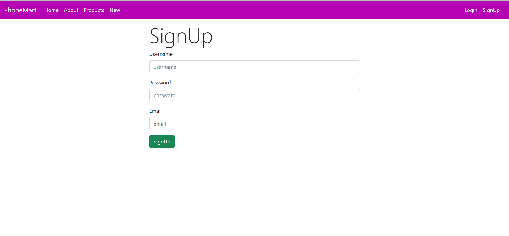
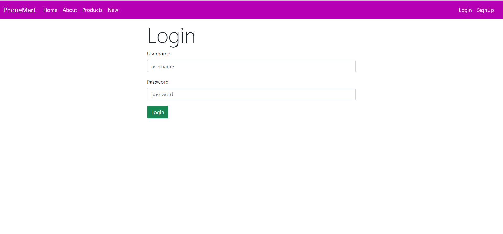
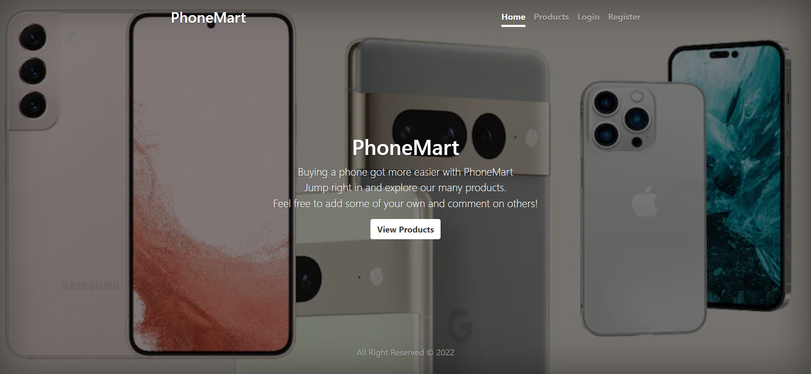
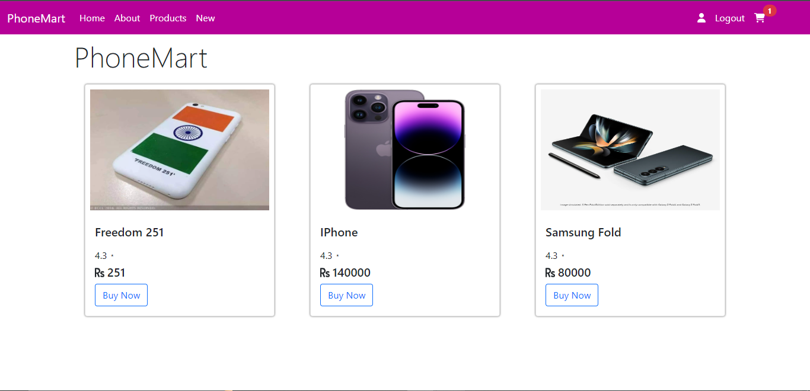

<h1 align="center">
    <b>phone_selling Website Made With<br>ExpressJs & Node.js using MongoDB </b> 
<br>
</h1>


<p align="center">
  <a href="/LICENSE"></a>
</p>


## What is this for?
This is a phone selling Website with Login systems app done with Node.js Framework using MongoDB(Atlas) as the data store, Express as the routing system, Body-parser as the parser for webpage, Express-session used  to track the user's session and of course Mongoose to make interacting with Mongo from Node easy.


### •SignUp Page:
Allows the user to register their account by filling their Email, Username, Password.



### •Login Page:
user who have already signed up can login by filling username and password.



### •Home Page:
After the user is logged in a simple page where you can list your phones to purchase and sell.



### •Phones : 
here user can check and buy the phone.



<br>
<br>
<br>

## Prerequisites
Tools that we need to run this app:

- ***[Node.js](https://nodejs.org/en/)***
- ***[Node Package Manager](https://www.npmjs.com/get-npm)***
- ***[MongoDB (Atlas)](https://www.mongodb.com/cloud/atlas)***

## Steps to run Website on Local Machine
```
1.First clone the project by Using Command git clone and paste the Link from code button.
2.After Cloning change your Current Directory to project Directory us (cd <directory name>)
3.run command npm install
4.Then run npm start
```

